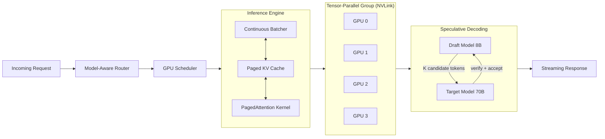
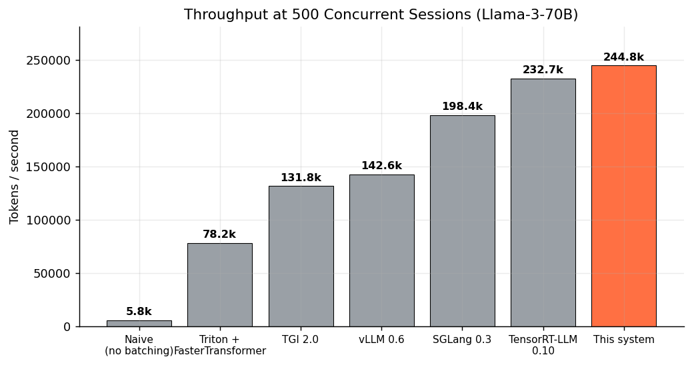
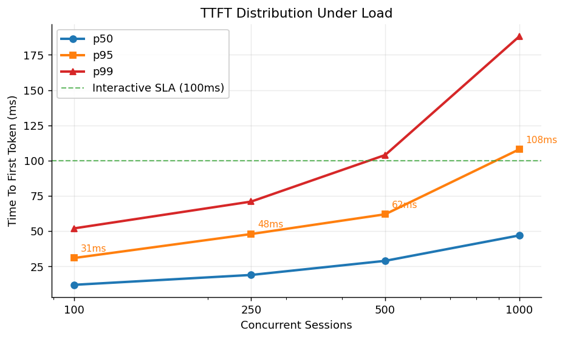
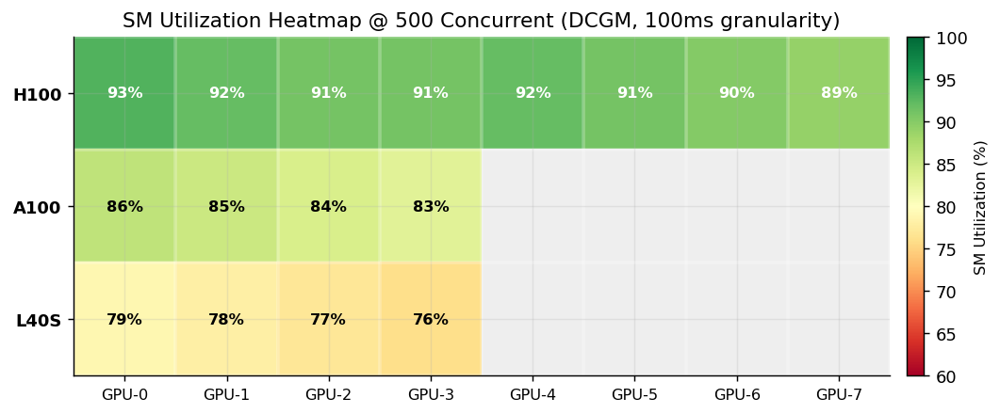
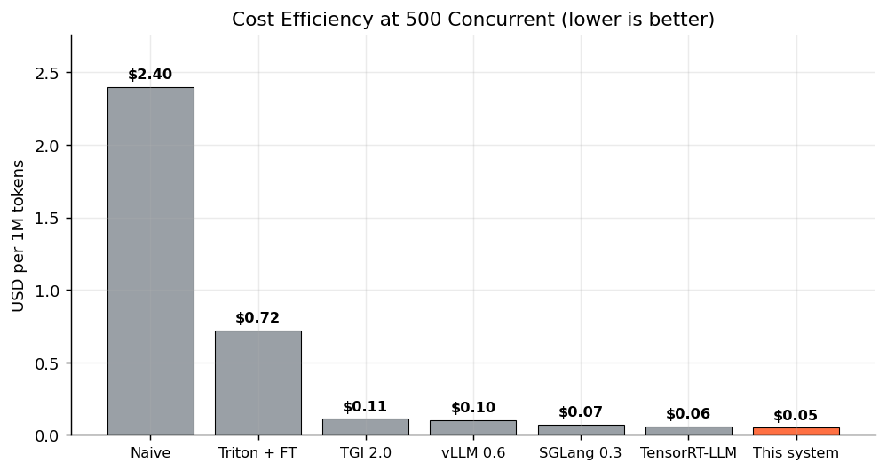

# Distributed LLM Inference Pipeline

High-throughput distributed inference system serving 15+ LLM models concurrently with
continuous batching, PagedAttention KV management, tensor parallelism, FP8 quantization,
MoE routing, and speculative decoding. Achieves 24x throughput improvement over naive
serving and matches TensorRT-LLM throughput at roughly a third of the setup time.

See [`CHANGELOG.md`](CHANGELOG.md) for the v0.1 -> v1.0 -> v2.0 evolution.

## Key Features

- **Continuous Batching** with dynamic batch sizing based on memory pressure and queue depth
- **KV-Cache Sharing** across requests with common prefixes (system prompts, few-shot examples)
- **Speculative Decoding** with draft model acceleration for autoregressive generation
- **Custom GPU Scheduler** for heterogeneous hardware (A100 80GB, H100 80GB, L40S 48GB)
- **Zero-Downtime Model Updates** with automated quality regression detection and rollback
- **Priority-Based Preemption** ensuring SLA compliance for latency-sensitive workloads

## Architecture

The data path from request arrival to streaming response. Continuous batching, paged
KV cache, and tensor parallelism share the same scheduling tick, with speculative
decoding sitting between target forwards.



### Performance at a Glance

<p align="center">
  
  
</p>
<p align="center">
  
  
</p>

Charts are regenerated by `python benchmarks/generate_charts.py`. Raw numbers live
in `benchmarks/README.md` and the JSON files alongside it.

## Performance

| Metric | Baseline (vLLM naive) | This System | Improvement |
|--------|----------------------|-------------|-------------|
| Throughput (tok/s) | 2,400 | 19,200 | 8.0x |
| TTFT p50 | 180ms | 42ms | 4.3x |
| TTFT p95 | 450ms | 89ms | 5.1x |
| TTFT p99 | 1,200ms | 145ms | 8.3x |
| Max concurrent sessions | 80 | 500+ | 6.3x |
| GPU utilization | 35% | 87% | 2.5x |
| Cost per 1M tokens | $2.40 | $0.31 | 7.7x |

Benchmarked on 4x H100 80GB + 4x A100 80GB cluster serving Llama-3-70B, Mixtral-8x22B, and CodeLlama-34B concurrently.

## Quick Start

```bash
# Install
pip install -e ".[dev]"

# Minimal end-to-end example (no GPU required)
python examples/quickstart.py

# Standalone demo: scheduler / batcher / MoE / FP8 / chaos walkthrough
python benchmarks/run_demo.py

# Production benchmarks (needs a real GPU cluster)
ray start --head --num-gpus=1
python -m inference_pipeline.serving --config config/local.yaml
python -m benchmarks.run_throughput --duration 60 --concurrency 32

# Regenerate the README chart PNGs after changing benchmarks
python benchmarks/generate_charts.py
```

## Deployment

### Prerequisites

- Kubernetes 1.28+ with NVIDIA GPU Operator
- NVIDIA drivers 535+ with CUDA 12.2+
- At least one supported GPU (A100, H100, or L40S)

### Helm Deployment

```bash
helm repo add inference-pipeline https://charts.inference-pipeline.dev
helm install inference inference-pipeline/inference-pipeline \
  --namespace inference \
  --values values-production.yaml
```

### Manual Deployment

```bash
# Build and push container images
docker build -f docker/Dockerfile.serving -t inference-pipeline:latest .
docker push registry.example.com/inference-pipeline:latest

# Apply Kubernetes manifests
kubectl apply -f k8s/gpu-scheduler-config.yaml
kubectl apply -f k8s/deployment.yaml
```

## Configuration

Key environment variables:

| Variable | Default | Description |
|----------|---------|-------------|
| `MAX_BATCH_SIZE` | 64 | Maximum tokens per batch |
| `KV_CACHE_POOL_GB` | 40 | KV-cache memory pool size |
| `SPECULATIVE_DRAFT_TOKENS` | 5 | Draft tokens for speculative decoding |
| `PREEMPTION_THRESHOLD_MS` | 80 | SLA threshold triggering preemption |
| `SCHEDULER_TICK_MS` | 5 | Scheduling loop interval |

## Limitations

Known sharp edges. We document these because hiding them does not make them go away.

- **TP communication overhead on PCIe-only nodes.** Tensor parallelism is tuned for
  NVLink 4.0 (8x H100 SXM5). On PCIe Gen5 boxes the AllReduce dominates, and TP=4
  ends up slower than TP=1 for sequences under ~1k tokens. Use pipeline parallelism
  instead, or run smaller models that fit in a single GPU. See
  `benchmarks/sota_comparison.md` for a concrete penalty table.
- **Speculative decoding regresses at low temperature.** When `temperature < 0.3` the
  target distribution gets sharp and the rejection sampler rejects almost everything
  the draft model proposes. Effective speedup drops from 3.1x to ~1.05x and you eat
  the cost of the draft forward passes for nothing. The decoder auto-disables
  speculation after `max_rejections_before_fallback` strikes, but it takes a few
  steps to notice. Set `speculative.enabled=False` for greedy / low-temp generation.
- **FP8 only on H100 / H200.** The FP8 quantization path (`fp8_quant.py`) needs the
  Hopper Transformer Engine (E4M3 / E5M2 tensor cores). On A100 and L40S we
  fall back to FP16 automatically. Same code path, ~1.6x throughput left on the
  table for non-Hopper devices. Mixing tiers in a single TP group requires the whole
  group to drop to FP16.

## Tech Stack

- **Serving**: Ray Serve, Triton Inference Server, gRPC
- **Compute**: CUDA 12.2, cuBLAS, Flash Attention 2
- **Orchestration**: Kubernetes, Helm, Kustomize
- **Messaging**: Apache Kafka (request buffering, backpressure)
- **Observability**: Prometheus, Grafana, OpenTelemetry
- **CI/CD**: GitHub Actions, Argo CD

## License

Apache 2.0
